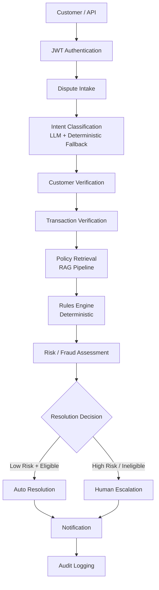
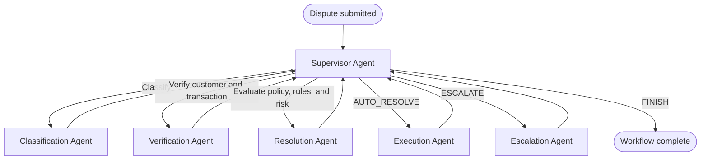

# AI-Powered Automated Bank Dispute Resolution System

An intelligent system that understands banking customer disputes, classifies them, verifies customers and transactions using mock banking APIs, retrieves relevant bank policies using RAG, applies deterministic banking rules, assesses risk, and either auto-resolves eligible low-risk disputes or escalates complex/high-risk disputes to human agents.

> **Note:** This system uses only synthetic/mock banking data. No real customer, account, card, transaction, or personally identifiable information is used.

---

## Architecture



### LangGraph Workflow



## Key Features

- **LLM-based Classification** with deterministic fallback for 10 dispute categories
- **RAG Pipeline** for banking policy retrieval with citations (FAISS + Sentence Transformers)
- **Deterministic Rules Engine** – LLM cannot override financial decisions
- **Risk/Fraud Scoring** – configurable, ML-ready (XGBoost drop-in)
- **LangGraph Agentic Workflow** – typed state, conditional routing, full tracing
- **Human-in-the-Loop Escalation** with SLA tracking and agent dashboard
- **JWT Authentication** with role-based access (Customer, Agent, Manager, Admin)
- **Immutable Audit Trail** for every decision and action
- **Notification Service** (email, SMS, in-app mocks)
- **Streamlit Frontend** – customer chat, agent dashboard, analytics
- **Docker Compose** – one-command deployment
- **GitHub Actions CI/CD**

## Technology Stack

| Layer | Technology |
|-------|-----------|
| API | FastAPI, Pydantic |
| Database | PostgreSQL, SQLAlchemy (async) |
| AI/LLM | LangChain, LangGraph, OpenAI (configurable) |
| RAG | Sentence Transformers, FAISS |
| Document Ingestion | PyMuPDF |
| Auth | JWT (python-jose), bcrypt |
| Frontend | Streamlit |
| Logging | structlog (JSON) |
| Tracing | LangSmith-compatible |
| Testing | pytest, pytest-asyncio |
| Deployment | Docker, Docker Compose |
| CI/CD | GitHub Actions |

## Project Structure

```
app/
├── api/v1/          # FastAPI route handlers
├── audit/           # Immutable audit trail service
├── core/            # Config, enums, logging
├── database/        # SQLAlchemy session management
├── models/          # SQLAlchemy ORM models
├── notifications/   # Notification service (mock providers)
├── rag/             # RAG pipeline (ingestion, retrieval)
├── rules/           # Deterministic rules engine
├── schemas/         # Pydantic request/response schemas
├── security/        # JWT auth, RBAC
├── services/        # Business logic (classification, risk, dispute)
├── tools/           # Mock banking tools (LLM-callable)
├── workflows/       # LangGraph graph + node definitions
└── main.py          # FastAPI application entry point
documents/policies/  # Banking policy documents (MD/PDF)
frontend/            # Streamlit UI
scripts/             # Seed data, policy ingestion
tests/               # pytest suite
```

## Database Schema

| Table | Purpose |
|-------|---------|
| customers | Customer profiles, auth credentials |
| accounts | Bank accounts linked to customers |
| cards | Debit/credit cards |
| transactions | Transaction records (UPI, ATM, NEFT, etc.) |
| disputes | Dispute cases |
| dispute_events | Event timeline per dispute |
| resolutions | Resolution details and refund info |
| escalations | Human escalation queue |
| policy_metadata | Ingested policy document metadata |
| audit_logs | Immutable audit trail |
| notifications | Notification delivery log |

## API Endpoints

### Auth
- `POST /api/v1/auth/login` – Get JWT token

### Disputes
- `POST /api/v1/disputes` – Submit a new dispute
- `POST /api/v1/disputes/classify` – Classify complaint text
- `GET /api/v1/disputes/{id}` – Get dispute details
- `GET /api/v1/disputes/{id}/status` – Get dispute status

### Customers
- `GET /api/v1/customers/me` – Current customer profile
- `GET /api/v1/customers/me/transactions` – Customer transactions

### Escalations (Agent/Manager)
- `GET /api/v1/escalations` – List escalation queue
- `GET /api/v1/escalations/{id}` – Escalation details
- `POST /api/v1/escalations/{id}/assign` – Assign to agent
- `POST /api/v1/escalations/{id}/resolve` – Resolve escalation

## Rules Engine

The rules engine operates **independently from the LLM** and evaluates:
- Transaction status, type, and amount
- Customer verification status
- Previous dispute history
- Fraud indicators
- Policy eligibility
- Amount thresholds per category

**The LLM cannot override rules engine decisions.**

## Risk Engine

Deterministic scoring based on:
- Transaction amount and type
- Fraud indicators
- Customer dispute frequency
- Authentication status
- Transaction age

Risk levels: `LOW` → `MEDIUM` → `HIGH` → `CRITICAL`

HIGH/CRITICAL cases always require human review.

## Security

- JWT-based API authentication
- Role-based access: CUSTOMER, SUPPORT_AGENT, DISPUTE_MANAGER, ADMIN
- Account/card numbers masked in API responses
- Sensitive data (passwords, tokens, CVV) never logged
- Input validation on all endpoints
- CORS configuration
- Structured logging with sanitization

## Installation

### Prerequisites
- Python 3.11+
- PostgreSQL 15+
- Docker & Docker Compose (for containerized deployment)

### Local Setup

```bash
# Clone and enter project
cd automated_dispute_resolution

# Create virtual environment
python -m venv .venv
source .venv/bin/activate

# Install dependencies
pip install -e ".[dev]"

# Copy environment file
cp .env.example .env
# Edit .env with your configuration

# Initialize database and seed data
python -m scripts.seed

# Ingest policy documents
python -m scripts.ingest_policies

# Run the API server
uvicorn app.main:app --reload --port 8000

# Run Streamlit frontend (separate terminal)
streamlit run frontend/app.py --server.port 8501
```

### Docker Deployment

```bash
docker compose up --build
```

Services:
- Backend API: http://localhost:8000
- Frontend: http://localhost:8501
- PostgreSQL: localhost:5432
- API Docs: http://localhost:8000/docs

## Environment Variables

See [.env.example](.env.example) for all configuration options.

Key variables:
- `DATABASE_URL` – PostgreSQL connection string
- `JWT_SECRET_KEY` – JWT signing key
- `OPENAI_API_KEY` – LLM API key
- `LLM_MODEL` – Model name (default: gpt-4o-mini)
- `EMBEDDING_MODEL` – Embedding model (default: all-MiniLM-L6-v2)

## Running Tests

```bash
# All tests
pytest

# With coverage
pytest --cov=app --cov-report=html

# Specific test file
pytest tests/test_rules.py -v
```

## Example Dispute Scenarios

### Scenario 1: UPI Failed (Auto-resolved)
> "My UPI transaction failed but Rs. 500 was deducted."
- Classified as `UPI_FAILED`, low amount → auto-refund

### Scenario 2: ATM Cash Not Received
> "ATM did not give me cash but Rs. 10,000 was deducted."
- Classified as `ATM_CASH_NOT_RECEIVED`, within auto-limit → auto-refund

### Scenario 3: Unauthorized Card (Escalated)
> "I don't recognize this Rs. 75,000 card transaction."
- Classified as `UNAUTHORIZED_CARD_TRANSACTION`, fraud indicator → escalated to fraud team

### Scenario 4: Refund Not Received
> "My refund has not arrived."
- Classified as `REFUND_NOT_RECEIVED`, check refund status → determine action

### Scenario 5: Authentication Failure
- Customer cannot verify identity → workflow stops, escalated

### Scenario 6: No Policy Found
- No matching policy → no autonomous action → human escalation

## Example API Request

```bash
# Login
curl -X POST http://localhost:8000/api/v1/auth/login \
  -H "Content-Type: application/json" \
  -d '{"email": "aarav.sharma0@example.com", "password": "Test@1234"}'

# Submit dispute
curl -X POST http://localhost:8000/api/v1/disputes \
  -H "Authorization: Bearer <token>" \
  -H "Content-Type: application/json" \
  -d '{"customer_message": "My UPI transaction failed but Rs. 500 was deducted."}'
```

## License

This project is for educational and demonstration purposes only. Uses only synthetic data.
